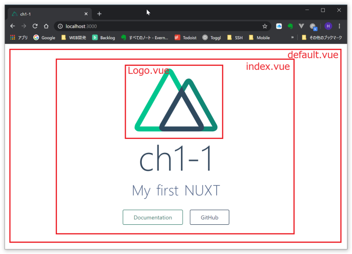

## 概要
- [概要](#概要)
- [プロジェクト作成](#プロジェクト作成)
  - [起動する](#起動する)
- [NUXTの解説](#nuxtの解説)
  - [NUXTのフォルダ構成について](#nuxtのフォルダ構成について)
  - [画面構成について](#画面構成について)
  - [Vueの構成について](#vueの構成について)
  - [リアクティブとは？](#リアクティブとは)
- [次回以降の準備](#次回以降の準備)
  - [実習用ページの追加](#実習用ページの追加)
  - [メニューの追加](#メニューの追加)
- [webapp ソースの取得](#webapp-ソースの取得)
  - [historyからソースを取得](#historyからソースを取得)
  - [git hub からソースを取得](#git-hub-からソースを取得)
  - [モジュールダウンロード](#モジュールダウンロード)

---
## プロジェクト作成
作業ディレクトリで下記のように入力します。
```
CMD> npx create-nuxt-app webapp
```
いくつかの質問に答えていきます。
- programming language: **JavaScript**
- package manager: **Yarn**
- I framework: **Element**
- Nuxt.js modules: **Axios**
- rendering mode: **Single Page App**
```
create-nuxt-app v2.15.0
✨  Generating Nuxt.js project in webapp
? Project name webapp
? Project description My first NUXT
? Author name Hisakazu KATO
? Choose programming language JavaScript
? Choose the package manager Yarn
? Choose UI framework Element
? Choose custom server framework None (Recommended)
? Choose Nuxt.js modules Axios
? Choose linting tools ESLint, Prettier
? Choose test framework None
? Choose rendering mode Single Page App
? Choose development tools jsconfig.json (Recommended for VS Code)
```

プロジェクトが作成されました。<br/>

### 起動する
早速起動してみます。<br/>
webappのディレクトリに移動して、yarn dev で起動します。
```
CMD> cd webapp
CMD> yarn dev
```

```
    :
    :
i Listening on: http://localhost:3000/   
```
Listening on ... と表示されれば、起動は完了です。<br/>
ブラウザを立ち上げで、以下のURLにアクセスします。<br/>
(ブラウザはフロントエンドのデバッグが容易なchromeをお勧めします)

```
http://localhost:3000/
```
無事、画面が表示されたでしょうか？


終了するにはコマンドラインから **```Ctrl+C```** を入力します。

## NUXTの解説
### NUXTのフォルダ構成について
フォルダ構成を確認します。
```
webapp
    +- .nuxt         : 本番で公開される内容
    +- assets        : コンパイルが必要な静的がファイル(CSSなど)
    +- components    : VUE部品を管理(サンプルではLogo)
    +- layouts       : ページのテンプレートを管理
    +- middleware    : 認証などページを表示する共通前処理を定義
    +- node_modules  : 必要なモジュールを保存(パッケージマネージャが管理)
    +- pages         : 画面モジュールを管理
    +- plugins       : 共通ファンクションなどを管理
    +- static        : コンパイル不要なイメージなどの静的ファイルを管理
    +- store         : Vuexという全体で利用可能なメモリを管理
```

### 画面構成について
サンプル画面は次の様な構成となっています。
```
layout/default.vue
    +- pages/index.vue
        +- componets/Logo.vue
```


### Vueの構成について
index.vueを参考に、Vueの構成について解説します。
```html
<template>
    :           画面に表示する内容をタグ形式で表現します
</template>

<script>
    :           バックエンドとのやりとりや、画面内のデータを
    :           JavaScriptで記述します
</script>

<style>
    :           画面表示する要素の色や大きさ、配置をCSSで指定します
</stye>
```

### リアクティブとは？
NUXTのベースであるVueの特徴 **「リアクティブ」** の概念について初期ページに手を加えて確認します。<br/>
リアクティブとは簡単に言えば、「変化する変数の内容をリアルタイムに画面表示する」ものです。

h2要素の"My first NUX"の下に、次のように要素を追加します。
```html
<div class="links">
  <p>{{ message }}</p>
  <input v-model="message" />
</div>
```

script部分にmessageの定義を追加します。
```javascript
export default {
  components: {
    Logo
  },
  data() {
    return {
      message: ''
    }
  }
}
```

入力欄に入力した文字がリアルタイムで上部のメッセージに反映されるのがわかります。

従来のWEB画面では表示内容を書き換えるのにリロードが必要でしたが、VueではDOMの状態を管理しており、バインドされた変数に変化があればその部分だけを書き換えるように出来ています。

## 次回以降の準備
### 実習用ページの追加
実習用ページとして、**「pages/items.vue」** を追加します。
```html
<template>
  <div>
    <el-row type="flex" justify="center" style="margin-top: 2rem;">
      <el-col :span="2">
        <div></div>
      </el-col>
      <el-col :span="20">
        <div>
          <h2>Items</h2>
        </div>
      </el-col>
      <el-col :span="2">
        <div></div>
      </el-col>
    </el-row>
  </div>
</template>
```

参考URL: ElementUI/Layout<br/>
https://element.eleme.io/#/en-US/component/layout

### メニューの追加
Single Page Application ですが、一応メニューも追加してみます。

**「layout/default.vue」** ElementUIの水平メニューを追加します。

&lt;template&gt;内に&lt;el-menu ..&gt; ~ &lt;/el-menu&gt; 部分を追加
```html
<template>
  <div>
    <el-menu :default-active="activeIndex" mode="horizontal" router>
      <el-menu-item index="/">About</el-menu-item>
      <el-menu-item index="/items">Items</el-menu-item>
    </el-menu>
    <nuxt />
  </div>
</template>
```
script部分に下記を追加
```javascript
<script>
export default {
  data() {
    return {
      activeIndex: '/'
    }
  },
  mounted() {
    this.activeIndex = this.$route.path
  }
}
</script>
```
参考URL: ElementUI/Navimenu<br/>
https://element.eleme.io/#/en-US/component/menu

比較的少ない手間で、メニューバーが追加できることを体験頂きました。


## webapp ソースの取得
### historyからソースを取得
ソースファイルフォルダ：10_WEBAPP\history\webapp

### git hub からソースを取得
今回(webapp終了時点)のソースを取得するには、以下のコマンドを実行します。

```
git clone https://github.com/hiszuk/webapp.git -b webapp --depth 1 webapp
```

### モジュールダウンロード
画面を起動するには必要モジュールのダウンロードが必要です。

```
yarn install
```

ダウンロードできない場合、以下のフォルダよりnode_modulesをコピーしてください。

50_ETC\node_modules

