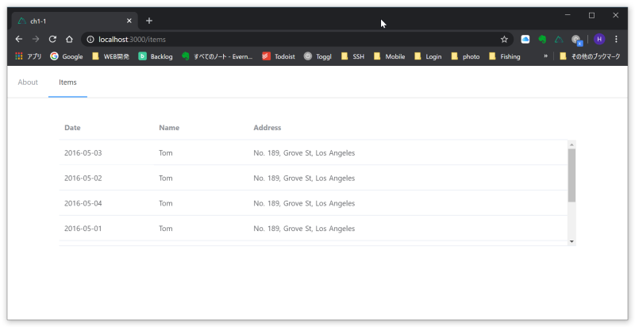
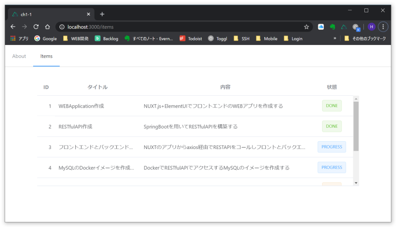
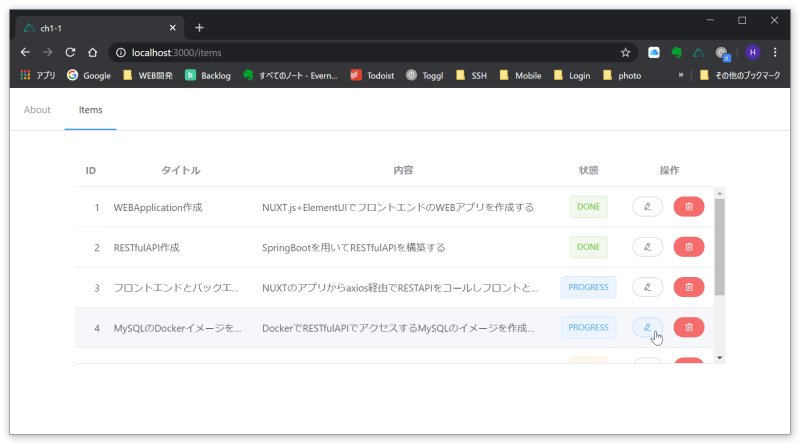

## 概要
- [概要](#概要)
- [テーブルの実装](#テーブルの実装)
  - [ヘッダ固定のテーブルを実装する](#ヘッダ固定のテーブルを実装する)
  - [カラムとデータを今回の実習用に変更します](#カラムとデータを今回の実習用に変更します)
  - [Edit/Deleteボタン追加](#editdeleteボタン追加)
- [絞り込み検索の実装](#絞り込み検索の実装)
  - [入力欄の追加](#入力欄の追加)

---

## テーブルの実装
### ヘッダ固定のテーブルを実装する

https://element.eleme.cn/#/en-US/component/table#table-with-fixed-header

上記のソースをコピーしてテーブルを作成する。

```html
  <el-table :data="tableData" height="250" style="width: 100%">
    <el-table-column prop="date" label="Date" width="180"></el-table-column>
    <el-table-column prop="name" label="Name" width="180"></el-table-column>
    <el-table-column prop="address" label="Address"></el-table-column>
  </el-table>
```
script部分もコピーします。

```JavaScript
<script>
export default {
    data() {
        return {
        tableData: [{
            date: '2016-05-03',
            name: 'Tom',
            address: 'No. 189, Grove St, Los Angeles'
        }, {
            date: '2016-05-02',
            name: 'Tom',
            address: 'No. 189, Grove St, Los Angeles'
        }, {
            date: '2016-05-04',
            name: 'Tom',
            address: 'No. 189, Grove St, Los Angeles'
        }, {
            date: '2016-05-01',
            name: 'Tom',
            address: 'No. 189, Grove St, Los Angeles'
        }, {
            date: '2016-05-08',
            name: 'Tom',
            address: 'No. 189, Grove St, Los Angeles'
        }, {
            date: '2016-05-06',
            name: 'Tom',
            address: 'No. 189, Grove St, Los Angeles'
        }, {
            date: '2016-05-07',
            name: 'Tom',
            address: 'No. 189, Grove St, Los Angeles'
        }],
        }
    }
}
</script>
```
動かしてみます。
```
CMD> yarn dev
```
prettierのエラーが出たら…
```
CMD> yarn lint --fix
```
で整形してもらいます。

再度起動し、http://localhost:3000/items にアクセスします。



テーブルが実装できました。

### カラムとデータを今回の実習用に変更します

＜実習用データ＞

| id | title | content | status |
|----|-------|---------|--------|
| 1 | WEB Application作成 | NUXT.js+ElementUIでフロントエンドのWEBアプリを作成する | DONE |
| 2 | RESTful API作成 | Spring Bootを用いてRESTful APIを構築する | DONE |
| 3 | フロントエンドとバックエンドを結合 | NUXTのアプリからaxios経由でREST APIをコールしフロントとバックエンドを繋げる | PROGRESS | 
| 4 | MySQLのDockerイメージを作成する | DockerでRESTful APIでアクセスするMySQLのイメージを作成する | PROGRESS |
| 5 | バックエンドのDockerイメージを作成する | Javaのイメージにバックエンドのjarをレイヤー化したイメージを作成する | TODO |
| 6 | フロントエンドのDockerイメージを作成する | Node.jsからNUXTをインストールしWEBアプリをコピー後にbuildするイメージを作成する | TODO |
| 7 | Docker-composeでパッケージ化する | フロントエンド・バックエンド・DBの3層をひとつのパッケージにまとめる | TODO | 

テーブルのカラムを変更する
```html
<el-table ref="itemTable" :data="tableData" height="300" style="width: 100%">
  <el-table-column prop="id" label="ID" min-width="40" header-align="center" align="right"></el-table-column>
  <el-table-column prop="title" label="タイトル" min-width="200" header-align="center" show-overflow-tooltip></el-table-column>
  <el-table-column prop="content" label="内容" min-width="400" header-align="center" show-overflow-tooltip></el-table-column>
  <el-table-column prop="status" label="状態" min-width="100" align="center">
    <template slot-scope="scope">
      <el-tag :type="scope.row.status === 'DONE' ? 'success' : (scope.row.status === 'PROGRESS' ? 'primary' : 'warning')" disable-transitions>
        {{ scope.row.status }}
      </el-tag>
    </template>
  </el-table-column>
</el-table>
```
データ部分
```json
{
  id: '1',
  title: 'WEBApplication作成',
  content: 'NUXT.js+ElementUIでフロントエンドのWEBアプリを作成する',
  status: 'DONE'
},
{
  id: '2',
  title: 'RESTfulAPI作成',
  content: 'SpringBootを用いてRESTfulAPIを構築する',
  status: 'DONE'
},
{
  id: '3',
  title: 'フロントエンドとバックエンドを結合',
  content: 'NUXTのアプリからaxios経由でRESTAPIをコールしフロントとバックエンドを繋げる',
  status: 'PROGRESS'
},
{
  id: '4',
  title: 'MySQLのDockerイメージを作成する',
  content: 'DockerでRESTfulAPIでアクセスするMySQLのイメージを作成する',
  status: 'PROGRESS'
},
{
  id: '5',
  title: 'バックエンドのDockerイメージを作成する',
  content: 'Javaのイメージにバックエンドのjarをレイヤー化したイメージを作成する',
  status: 'TODO'
},
{
  id: '6',
  title: 'フロントエンドのDockerイメージを作成する',
  content: 'Node.jsからNUXTをインストールしWEBアプリをコピー後にbuildするイメージを作成する',
  status: 'TODO'
},
{
  id: '7',
  title: 'Docker-composeでパッケージ化する',
  content: 'フロントエンド・バックエンド・DBの3層をひとつのパッケージにまとめる',
  status: 'TODO'
}
```


### Edit/Deleteボタン追加
下記サンプルを参考に操作ボタンを追加する

https://element.eleme.cn/#/en-US/component/table#custom-column-template

せっかくなので文字ではなくアイコンボタンにしてみます。

https://element.eleme.cn/#/en-US/component/icon


```html
<el-table-column label="操作" min-width="120" header-align="center">
  <template slot-scope="scope">
    <el-button size="mini" round @click="handleEdit(scope.$index, scope.row)"><i class="el-icon-edit"></i> </el-button>
    <el-button size="mini" type="danger" round @click="handleDelete(scope.$index, scope.row)"><i class="el-icon-delete"></i> </el-button>
  </template>
</el-table-column>
```
script追加部分
```JavaScript
  methods: {
    handleEdit(index, row) {
      console.log(index, row);
    },
    handleDelete(index, row) {
      console.log(index, row);
    }
  }
```


## 絞り込み検索の実装

内容で部分一致でデータを絞り込む機能を実装します。

### 入力欄の追加
下記サンプルを元に入力欄を追加します。

https://element.eleme.cn/#/en-US/component/input#mixed-input

```html
  <el-input placeholder="検索文字列を入力" v-model="search">
    <template slot="prepend">内容を検索する</template>
  </el-input>
```
scriptに検索文字列を保持する変数「search」追加
```
  data() {
    return {
      tableData: [
        :
      ],
      search: ''
    }
  },
```
tableDataから絞り込む処理に変更

https://element.eleme.cn/#/en-US/component/table#table-with-custom-header

```
:data="
  tableData.filter(
    (data) =>
      !search ||
      data.content.toLowerCase().includes(search.toLowerCase())
  )
"
```


