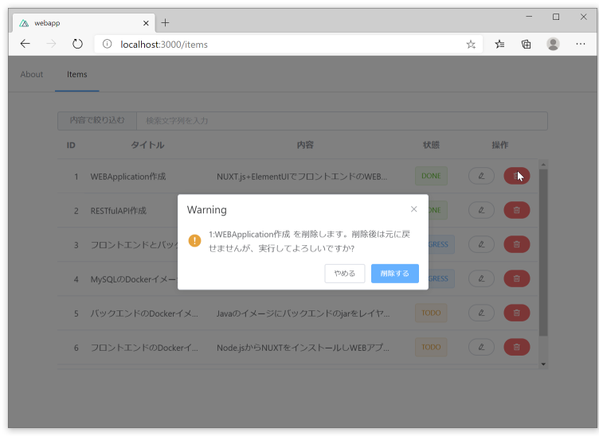

# 削除処理実装


---
## メッセージボックス実装
削除確認のためのメッセージボックスを実装します。

参考URL： https://element.eleme.io/#/en-US/component/message-box#confirm

上記を元に選択行の削除確認を行うメッセージボックスをmethodsに実装します。

```JavaScript
confirmDelete() {
  const row = this.$refs.itemTable.data[this.rowNumber]
  const target = `${row.id}:${row.title}`
  const msg = `${target} を削除します。削除後は元に戻せませんが、実行してよろしいですか?`
  this.$confirm(msg, 'Warning', {
    confirmButtonText: '削除する',
    cancelButtonText: 'やめる',
    type: 'warning'
  })
    .then(() => {
      // ToDo: REST API 削除処理を起動

      this.$message({
        type: 'success',
        message: `${target} : 削除が成功しました。`,
        showClose: true,
        duration: 5000
      })
    })
    .catch(() => {
      this.$message({
        type: 'info',
        message: '削除を中止しました。'
      })
    })
}
```

削除処理の際にメッセージボックスを起動するよう修正します。

```JavaScript
handleDelete(index, row) {
  this.rowNumber = index
  this.confirmDelete()
},
```

削除ボタンクリック後、下図のようなメッセージボックスが表示されます。



## 暫定の削除処理を実装します。
暫定の削除処理は、配列要素を削除する **splice** を使用します。

```JavaScript
    .then(() => {
      // ToDo: REST API 削除処理を起動
      this.$refs.itemTable.data.splice(this.rowNumber, 1)
      this.$message({
        type: 'success',
        message: `${target} : 削除が成功しました。`,
        showClose: true,
        duration: 5000
      })
    })
```

